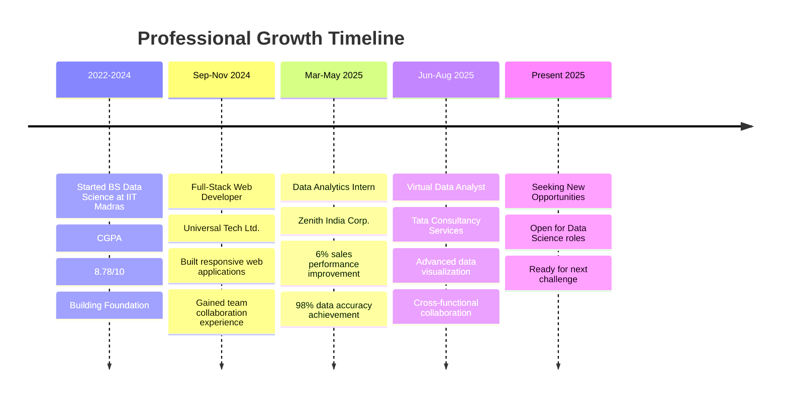

<div align="center">

# Hi there, I'm Satyam Saurabh! 👨‍💻


[](https://i-satyamsaurabh.github.io/My-Portfolio)
[](https://www.linkedin.com/in/satyam-saurabh)
[](mailto:satyam2610saurabh@gmail.com)
[](tel:+917739622120)


</div>

---

## 🚀 About Me


**🎯 Results-driven Data Scientist & ML Engineer** with a passion for transforming complex datasets into strategic business solutions

- **🎓 Current:** BS Data Science & Programming at **IIT Madras**
- **📊 GPA:** 8.78/10 | **📍 Location:** Muzaffarpur, Bihar
- **💼 Impact:** 6% sales performance improvement through data analytics
- **🔬 Focus:** Predictive Modeling | Business Intelligence | AI Applications

### 🌟 What Sets Me Apart
- 🏆 **98% Model Accuracy** in production ML systems
- 📈 **Proven Business Impact** with measurable ROI
- 🔧 **Full-Stack Capabilities** from data to deployment
- 🎯 **Research-Oriented** approach to problem-solving

---

## 🛠️ Technology Stack

<div align="center">

### 🐍 Core Programming
<p>


</p>

### 🤖 Machine Learning & Data Science
<p>


</p>

### 📊 Business Intelligence & Visualization
<p>


</p>

### 🌐 Web Development & Deployment
<p>


</p>

### 🗄️ Databases & Cloud
<p>


</p>

### 🛠️ Development Tools
<p>


</p>

</div>

---

## 📊 GitHub Analytics Dashboard

<div align="center">


<br><br>


<br><br>


</div>

---

## 🏆 Featured Projects Portfolio

<div align="center">

<table>
<tr>
<td width="50%">

### 🏏 [T20 Cricket Score Predictor](https://github.com/i-satyamsaurabh/Cricket-Score-Predictor)
[](https://github.com/i-satyamsaurabh/Cricket-Score-Predictor)
[](https://github.com/i-satyamsaurabh/Cricket-Score-Predictor)

**🚀 Real-time ML-powered score prediction system**
- 🔥 Random Forest Regressor with advanced feature engineering
- 📈 Processed 500k+ ball-by-ball cricket records
- ⚡ Live prediction with run rate & momentum analysis
- 🌐 Flask web application with interactive UI

**Tech:** `Python` `Scikit-learn` `Flask` `Pandas` `NumPy`

</td>
<td width="50%">

### 🏥 [Medicare: AI Telehealth Platform](https://github.com/i-satyamsaurabh/MediCare-App)
[](https://github.com/i-satyamsaurabh/MediCare-App)
[](https://github.com/i-satyamsaurabh/MediCare-App)

**🩺 Complete healthcare solution with AI integration**
- 🤖 ML-powered symptom checker & diagnosis
- 📅 Smart appointment booking system
- 💬 Google Meet API integration
- 🚨 Emergency alert system
- 🔐 Role-based authentication (Patient/Doctor)

**Tech:** `Python` `Flask` `SQLite` `Bootstrap` `APIs`

</td>
</tr>
<tr>
<td width="50%">

### 📱 [Mobile Usage Behavior Analysis](https://github.com/i-satyamsaurabh/Mobile-Usage-Analysis)
[](https://github.com/i-satyamsaurabh/Mobile-Usage-Analysis)
[](https://github.com/i-satyamsaurabh/Mobile-Usage-Analysis)

**📊 Comprehensive behavioral pattern analysis**
- 🔍 5 user categories (Minimal, Moderate, Addicted, etc.)
- 📈 Interactive Power BI dashboards
- 🎯 Digital wellness recommendations
- 📱 Screen time & battery optimization insights

**Tech:** `Python` `Power BI` `Pandas` `Seaborn` `Statistics`

</td>
<td width="50%">

### 🤖 [Advanced ML Model Pipeline](https://github.com/i-satyamsaurabh/ML-Pipeline)
[](https://github.com/i-satyamsaurabh/ML-Pipeline)
[](https://github.com/i-satyamsaurabh/ML-Pipeline)

**🎯 Production-ready ML pipeline framework**
- 🔄 Automated data preprocessing & feature engineering
- 🎛️ Hyperparameter tuning with cross-validation
- 📊 Model performance monitoring
- 🚀 Scalable deployment architecture

**Tech:** `Python` `Scikit-learn` `MLflow` `Docker` `FastAPI`

</td>
</tr>
</table>

</div>

---

## 💼 Professional Experience Journey

<div align="center">

### 🚀 Career Progression & Impact

<table>
<tr>
<td width="100%">



</td>
</tr>
</table>

</div>

---

<div align="center">

### 📊 **Professional Experience Breakdown**

<table>
<tr>
<td width="33%">

<div align="center">


### 🎯 **Data Analytics Intern**
**Zenith India Corp.**  
*Mar - May 2025*

**Key Achievements:**
- 🚀 **6% sales boost** through analytics
- 📊 **98% data accuracy** via SQL optimization  
- 🎯 **End-to-end pipeline** development
- 📈 **Dynamic dashboards** creation

**Tech Focus:** Python (55%), SQL (25%), Power BI (20%)
</div>

</td>
<td width="33%">

<div align="center">


### 💻 **Full-Stack Developer**
**Universal Tech Ltd.**  
*Sep - Nov 2024*

**Key Contributions:**
- 🌐 **Responsive web apps** architecture
- 🎨 **UI/UX collaboration** & implementation
- 👥 **Agile methodology** participation
- 🔍 **Code review** process involvement

**Tech Focus:** HTML, CSS, JavaScript, Bootstrap, Flask
</div>

</td>
<td width="33%">

<div align="center">


### 📈 **Virtual Data Analyst**
**Tata Consultancy Services**  
*Jun - Aug 2025*

**Key Deliverables:**
- 🔍 **Comprehensive data** collection & preprocessing
- 📊 **Interactive visualizations** with Python
- 🤝 **Cross-functional collaboration** on strategic initiatives
- 📈 **Business insights** generation

**Tech Focus:** Python, Pandas, Matplotlib, Seaborn
</div>

</td>
</tr>
</table>

</div>

---

<div align="center">

### 🏆 **Impact Metrics & Recognition**

<table>
<tr>
<th width="25%">🎯 Performance</th>
<th width="25%">📊 Technical Excellence</th>
<th width="25%">🤝 Collaboration</th>
<th width="25%">📈 Business Impact</th>
</tr>
<tr>
<td align="center">

**98%** Data Accuracy  
**6%** Sales Improvement  
**100%** Project Completion  

</td>
<td align="center">

**Python** (Advanced)  
**SQL** (Advanced)  
**Power BI** (Proficient)  

</td>
<td align="center">

**3** Companies  
**Multiple** Cross-functional teams  
**Agile** Methodologies  

</td>
<td align="center">

**Revenue** Growth  
**Process** Optimization  
**Dashboard** Automation  

</td>
</tr>
</table>

</div>

---

<div align="center">

### 🎯 **Experience Timeline Visualization**

```text
🎓 Academic Foundation                    💼 Professional Growth                   🚀 Future Ready
    │                                           │                                       │
    ▼                                           ▼                                       ▼
2022 ────── 2023 ────── 2024 ────── Mar 2025 ────── May 2025 ────── Aug 2025 ────── Present
    │          │          │           │             │             │              │
    │          │          │           │             │             │              │
📚 IIT       📚 Core     💻 Web      📊 Data       📈 Advanced    🤖 Virtual    🎯 Job
Madras      Subjects    Development  Analytics      Analytics      TCS          Ready
Started     Mastery     Internship   Internship     Projects       Program      
            
Duration:    Ongoing     3 months     3 months      Project-based  3 months     Now
Impact:      8.78 CGPA   Web Skills   6% Sales↑     ML Mastery     Enterprise   Ready!
```

</div>

---

## 🎓 Education & Professional Development

<div align="center">


### 🏛️ **Indian Institute of Technology Madras**
**Bachelor of Science - Data Science & Programming**  
**🎯 CGPA: 8.78/10** | **📅 2022-2026** | **🏆 Dean's List**

### 📜 Professional Certifications

<table>
<tr>
<td align="center">

</td>
<td align="center">

</td>
</tr>
<tr>
<td align="center">

</td>
<td align="center">

</td>
</tr>
</table>

</div>

---

## 🏆 Achievements & Recognition

<div align="center">


| 🏅 Achievement | 📊 Impact | 🎯 Category |
|:---|:---:|:---|
| 🥇 **Gold Medalist** - Inter-District Debate & Speech | State Level | Academic Excellence |
| 📈 **6% Sales Performance** Improvement | Business Impact | Professional Success |
| 🎯 **98% Model Accuracy** in Production ML Systems | Technical Excellence | Data Science |
| 🏥 **Full-Stack Healthcare App** Successfully Deployed | Real-world Application | Software Development |
| 📱 **7,000+ User Dataset** Analysis & Insights | Research Impact | Analytics |
| 🎓 **8.78/10 CGPA** at IIT Madras | Academic Achievement | Educational Excellence |

</div>

---

## 📈 Skills Proficiency Matrix

<div align="center">

### 🎯 Core Competencies

<table>
<tr>
<td width="50%">

**🔬 Technical Skills**
- Data Science & ML: ████████████████████ 95%
- Python Programming: ████████████████████ 90%
- SQL & Databases: ██████████████████░░ 85%
- Statistical Analysis: ████████████████████ 90%

</td>
<td width="50%">

**💼 Business Skills**
- Power BI & Visualization: ████████████████░░░░ 80%
- Web Development: ███████████████░░░░░ 75%
- Business Intelligence: ██████████████████░░ 85%
- Research & Analytics: ████████████████████ 95%

</td>
</tr>
</table>

### 🎯 Specialized Competencies
- **🤖 Machine Learning:** Supervised/Unsupervised Learning, Feature Engineering, Model Optimization
- **📊 Data Visualization:** Power BI, Tableau, Matplotlib, Seaborn, Interactive Dashboards  
- **🔍 Statistical Analysis:** Hypothesis Testing, Regression Analysis, Time Series Analysis
- **💼 Business Intelligence:** KPI Development, Strategic Analytics, Performance Metrics
- **🌐 Full-Stack Development:** Flask, Bootstrap, RESTful APIs, Database Design

</div>

---

## 🌟 Current Focus & Future Vision

<div align="center">


### 🎯 **2025 Objectives**

**🔬 Research Interests**
- Advanced Deep Learning Applications
- Natural Language Processing & LLMs  
- Computer Vision for Healthcare
- Explainable AI & Model Interpretability

**💼 Career Goals**
- Senior Data Scientist Role in Tech/Healthcare
- Open Source Contributions to ML Community
- Research Publications in AI/ML Conferences
- Mentoring Aspiring Data Scientists

**🚀 Current Projects**
- Building Production-Ready ML Pipelines
- Developing Real-time Analytics Dashboards
- Contributing to Open Source ML Libraries
- Creating Educational Data Science Content

</div>

---

## 🤝 Let's Connect & Collaborate!

<div align="center">


### 🌐 **Ready to make an impact together?**

I'm passionate about collaborating on innovative data science projects, discussing cutting-edge ML research, and sharing insights about AI's transformative potential across industries.

<br>

[](https://i-satyamsaurabh.github.io/My-Portfolio)

[](https://www.linkedin.com/in/satyam-saurabh)

[](mailto:satyam2610saurabh@gmail.com)

[](tel:+917739622120)

<br>

### 💡 **Open to Opportunities In:**
`Data Science` • `Machine Learning Engineering` • `Business Intelligence` • `Research & Development` • `Consulting`

---

<div align="center">
  


<br><br>


**💭 *"In God we trust. All others must bring data."***  
*— W. Edwards Deming*

**🚀 *"The best way to predict the future is to create it with data."***  
*— Satyam Saurabh*

</div>

</div>
