# Hi there, I'm Satyam Saurabh! 👨‍💻

---

## 🚀 About Me

**🎯 Results-driven Data Scientist & ML Engineer** with a passion for transforming complex datasets into strategic business solutions

- **🎓 Current:** BS Data Science & Programming at **IIT Madras**
- **📊 GPA:** 8.78/10 | **📍 Location:** Muzaffarpur, Bihar
- **💼 Impact:** 6% sales performance improvement through data analytics
- **🔬 Focus:** Predictive Modeling | Business Intelligence | AI Applications

### 🌟 What Sets Me Apart
- 🏆 **98% Model Accuracy** in production ML systems
- 📈 **Proven Business Impact** with measurable ROI
- 🔧 **Full-Stack Capabilities** from data to deployment
- 🎯 **Research-Oriented** approach to problem-solving

---

## 🛠️ Technology Stack

### 🐍 Core Programming

### 🤖 Machine Learning & Data Science

### 📊 Business Intelligence & Visualization

### 🌐 Web Development & Deployment

### 🗄️ Databases & Cloud

### 🛠️ Development Tools

---

## 📊 GitHub Analytics Dashboard

  

  

---

## 🏆 Featured Projects Portfolio

<table>
<tr>
<td width="50%">

### 🏏 [T20 Cricket Score Predictor](https://github.com/i-satyamsaurabh/Cricket-Score-Predictor)

**🚀 Real-time ML-powered score prediction system**
- 🔥 Random Forest Regressor with advanced feature engineering
- 📈 Processed 500k+ ball-by-ball cricket records
- ⚡ Live prediction with run rate & momentum analysis
- 🌐 Flask web application with interactive UI

**Tech:** `Python` `Scikit-learn` `Flask` `Pandas` `NumPy`

</td>
<td width="50%">

### 🏥 [Medicare: AI Telehealth Platform](https://github.com/i-satyamsaurabh/MediCare-App)

**🩺 Complete healthcare solution with AI integration**
- 🤖 ML-powered symptom checker & diagnosis
- 📅 Smart appointment booking system
- 💬 Google Meet API integration
- 🚨 Emergency alert system
- 🔐 Role-based authentication (Patient/Doctor)

**Tech:** `Python` `Flask` `SQLite` `Bootstrap` `APIs`

</td>
</tr>
<tr>
<td width="50%">

### 📱 [Mobile Usage Behavior Analysis](https://github.com/i-satyamsaurabh/Mobile-Usage-Analysis)

**📊 Comprehensive behavioral pattern analysis**
- 🔍 5 user categories (Minimal, Moderate, Addicted, etc.)
- 📈 Interactive Power BI dashboards
- 🎯 Digital wellness recommendations
- 📱 Screen time & battery optimization insights

**Tech:** `Python` `Power BI` `Pandas` `Seaborn` `Statistics`

</td>
<td width="50%">

### 🤖 [Advanced ML Model Pipeline](https://github.com/i-satyamsaurabh/ML-Pipeline)

**🎯 Production-ready ML pipeline framework**
- 🔄 Automated data preprocessing & feature engineering
- 🎛️ Hyperparameter tuning with cross-validation
- 📊 Model performance monitoring
- 🚀 Scalable deployment architecture

**Tech:** `Python` `Scikit-learn` `MLflow` `Docker` `FastAPI`

</td>
</tr>
</table>

---

## 💼 Professional Experience Journey

### 🚀 **Career Development Timeline**

```mermaid
timeline
    title 🎯 Professional Growth Journey
    
    Sept 2022   : 🎓 Started BS Data Science
                : 📍 IIT Madras
                : 🏆 CGPA: 8.78/10
    
    Mar 2025    : 📊 Data Analytics Intern
                : 🏢 Zenith India Corp.
                : 📈 6% Sales Improvement
                : 🎯 98% Data Accuracy
                : ✅ Successfully Completed

    May 2025    : 💻 Web Developer Intern
                : 🏢 Universal Tech Ltd.
                : 🔧 Full-Stack Development
                : ✅ Successfully Completed
    
    July 2025    : 🔍 Data Analyst (Virtual)
                : 🏢 Tata Consultancy Services
                : 📊 Advanced Analytics
                : 🤝 Cross-functional Teams
                : ✅ Successfully Completed
    
    Aug 2025    : 🎯 Seeking New Opportunities
                : 🚀 Advanced ML Projects
                : 📈 Open Source Contributions
                : 🔬 Research & Innovation
```

 

### 📋 **Detailed Experience Breakdown**

<table>
<tr>
<td align="center" width="25%">

  
<strong>🗓️ Mar - May 2025</strong> 
<em>Data Analytics Intern</em>  
🚀 <strong>6% Sales Boost</strong> 
📈 <strong>98% Data Accuracy</strong> 
🔧 <strong>SQL + Python + Power BI</strong> 
</td>

<td align="center" width="25%">

  
<strong>🗓️ Sep - Nov 2024</strong> 
<em>Full-Stack Developer</em>  
🌠<strong>Responsive Web Apps</strong> 
🨠<strong>UI/UX Collaboration</strong> 
👥 <strong>Agile Methodology</strong> 
</td>

<td align="center" width="25%">

  
<strong>🗓️ Jun - Aug 2025</strong> 
<em>Data Analyst (Virtual)</em>  
📊 <strong>Interactive Dashboards</strong> 
🔄 <strong>Data Pipelines</strong> 
🤠<strong>Team Collaboration</strong> 
</td>

<td align="center" width="25%">

  
<strong>🗓️ Present</strong> 
<em>Seeking Next Challenge</em>  
🚀 <strong>Advanced ML Projects</strong> 
📈 <strong>Open Source Work</strong> 
🔬 <strong>Research & Innovation</strong> 
</td>
</tr>
</table>

---

## 🎓 Education & Professional Development

### 🏛️ **Indian Institute of Technology Madras**
**Bachelor of Science - Data Science & Programming**  
**🎯 CGPA: 8.78/10** | **📅 2022-2026** | **🏆 Dean's List**

### 📜 Professional Certifications

<table>
<tr>
<td align="center">

</td>
<td align="center">

</td>
</tr>
<tr>
<td align="center">

</td>
<td align="center">

</td>
</tr>
</table>

---

## 🏆 Achievements & Recognition

| 🏅 Achievement | 📊 Impact | 🎯 Category |
|:---|:---:|:---|
| 🥇 **Gold Medalist** - Inter-District Debate & Speech | State Level | Academic Excellence |
| 📈 **6% Sales Performance** Improvement | Business Impact | Professional Success |
| 🎯 **98% Model Accuracy** in Production ML Systems | Technical Excellence | Data Science |
| 🏥 **Full-Stack Healthcare App** Successfully Deployed | Real-world Application | Software Development |
| 📱 **7,000+ User Dataset** Analysis & Insights | Research Impact | Analytics |
| 🎓 **8.78/10 CGPA** at IIT Madras | Academic Achievement | Educational Excellence |

---

## 📈 Skills Proficiency Matrix

### 🎯 Core Competencies

<table>
<tr>
<td width="50%">

**🔬 Technical Skills**
- Data Science & ML: ████████████████████ 90%
- Python Programming: ███████████████████ 90%
- SQL & Databases: ██████████████████░░ 85%
- Statistical Analysis: ████████████████████ 90%

</td>
<td width="50%">

**💼 Business Skills**
- Power BI & Visualization: ████████████████░ 80%
- Web Development: ███████████████░░░░░ 75%
- Business Intelligence: ██████████████████░░ 85%
- Research & Analytics: ████████████████████ 95%

</td>
</tr>
</table>

### 🎯 Specialized Competencies
- **🤖 Machine Learning:** Supervised/Unsupervised Learning, Feature Engineering, Model Optimization
- **📊 Data Visualization:** Power BI, Tableau, Matplotlib, Seaborn, Interactive Dashboards  
- **🔍 Statistical Analysis:** Hypothesis Testing, Regression Analysis, Time Series Analysis
- **💼 Business Intelligence:** KPI Development, Strategic Analytics, Performance Metrics
- **🌐 Full-Stack Development:** Flask, Bootstrap, RESTful APIs, Database Design

---

## 🌟 Current Focus & Future Vision

### 🎯 **2025 Objectives**

**🔬 Research Interests**
- Advanced Deep Learning Applications
- Natural Language Processing & LLMs  
- Computer Vision for Healthcare
- Explainable AI & Model Interpretability

**💼 Career Goals**
- Senior Data Scientist Role in Tech/Healthcare
- Open Source Contributions to ML Community
- Research Publications in AI/ML Conferences
- Mentoring Aspiring Data Scientists

**🚀 Current Projects**
- Building Production-Ready ML Pipelines
- Developing Real-time Analytics Dashboards
- Contributing to Open Source ML Libraries
- Creating Educational Data Science Content

---

## 🤝 Let's Connect & Collaborate!

### 🌐 **Ready to make an impact together?**

I'm passionate about collaborating on innovative data science projects, discussing cutting-edge ML research, and sharing insights about AI's transformative potential across industries.

 

 

### 💡 **Open to Opportunities In:**
`Data Science` • `Machine Learning Engineering` • `Data Analyst` • `Business Intelligence` • `Research & Development` 

---

  

  

**💭 *"In God we trust. All others must bring data."***  
*— W. Edwards Deming*

**🚀 *"The best way to predict the future is to create it with data."***  
*— Satyam Saurabh*

